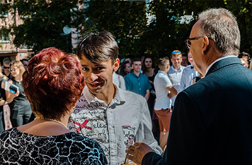
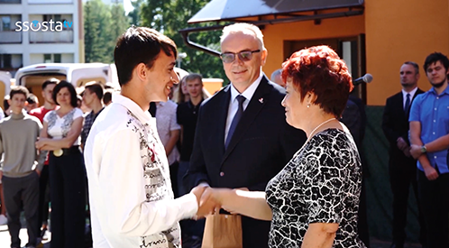
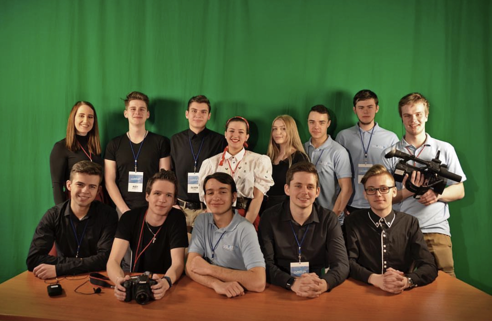

# The Story of My Study

Studying IT in high school was challenging due to its strict and demanding nature. However, it proved to be the best school experience of my life, as it prepared me significantly. Throughout my studies, I knew I wanted to become a filmmaker. Hence, I dedicated my free time to practicing filmmaking.

Later, I was honored by the school director who recognized my talent. She was supportive, providing me with self-confidence and courage. Upon completing my high school thesis on the art of filmmaking, I was also awarded by the high school.

I must point out that my high school specialized in information and digital technologies, far removed from filmmaking and cinematography. Nevertheless, I believe this background has been beneficial, providing me with a solid understanding of technology that can prove valuable in the film industry and my future work as a film director.

## SSOSTA TV

As mentioned earlier, I sought to expand my knowledge of filmmaking during my free time. Consequently, I joined SSOSTA TV at our high school. I gained valuable experience in teamwork, generated creative ideas, and developed essential technology skills.

## VŠKK (University of Creative Communication)

At [VŠKK University](https://www.vskk.cz/cz), I am acquiring new experiences in the animation and VFX field, skills that I believe will significantly contribute to my future role as a film director.

# Education:

## [High School](https://ssosta.edupage.org/?lang=sk) (2017 – 2021)
Private Secondary Technical School (SSOSTA), Poprad, Slovakia | Information and digital technologies 
## [University](https://www.vskk.cz/cz) (2021 – Present)
University of Creative Communication Na Pankráci 420/54 140 00 Prague 4 – Nusle | Animation and VFX

# BACK TO THE...
## [Main Page (English for designers)](https://github.com/BenjaminHaverla/English-for-designers.git)
## [ABOUT ME](https://github.com/BenjaminHaverla/Main-about-me.git)
## [Benjamín Haverla – Who am I ?](https://github.com/BenjaminHaverla/First-impression.git)
# Contact me:
## **Mail**: haverla.tros@gmail.com
